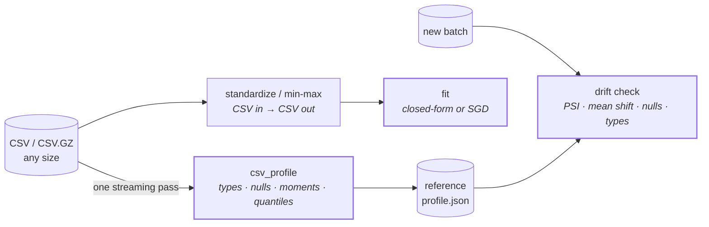

<div align="center">

# 🐻 Grizzly

<p align="center">
  <strong>Streaming feature statistics for training pipelines</strong>
  <br>
  <sub>Profile, scale, fit, and detect drift on datasets larger than memory — one pass, bounded memory, Rust core</sub>
</p>

<p align="center">
  
  
  
  
</p>

<p align="center">
  <a href="../../actions/workflows/ci.yml"></a>
  <a href="#performance"></a>
  
  
  
</p>

---

<p align="center">
  <a href="#quickstart"><b>Quickstart</b></a>&nbsp;&nbsp;•&nbsp;&nbsp;
  <a href="#features"><b>Features</b></a>&nbsp;&nbsp;•&nbsp;&nbsp;
  <a href="#performance"><b>Performance</b></a>&nbsp;&nbsp;•&nbsp;&nbsp;
  <a href="#ml-workflows"><b>ML Workflows</b></a>&nbsp;&nbsp;•&nbsp;&nbsp;
  <a href="#api-reference"><b>API</b></a>&nbsp;&nbsp;•&nbsp;&nbsp;
  <a href="#development"><b>Development</b></a>
</p>

<!-- HIGHLIGHTS:START -->

<!-- Generated by `python -m benches.render --write` from committed
     benchmark results. The hero numbers are held to the same standard
     as the tables: measured, never typed. -->

<table>
<tr>
<td align="center"><h3>2.0×</h3><sub>faster profiling<br>than polars</sub></td>
<td align="center"><h3>2.1–3.9×</h3><sub>less peak memory<br>than polars</sub></td>
<td align="center"><h3>9×</h3><sub>faster model fits than<br>pandas + sklearn</sub></td>
<td align="center"><h3>599 MB in 250m</h3><sub>transforms where polars<br>is OOM-killed</sub></td>
</tr>
</table>

<sub>All measured in a pinned container · [methodology](benches/README.md) · regenerated by `make render`</sub>

<!-- HIGHLIGHTS:END -->

</div>

---

## Overview

Grizzly summarises, scales, and fits models over CSV data in a **single
streaming pass**, with a Rust (PyO3) core. Memory stays bounded by the chunk
size rather than the file size, so the input can be larger than RAM.

The point is not to be another DataFrame. It is the layer *underneath* one —
the part of a training pipeline that has to answer "what does this data look
like, is it still the same as last month, and can I fit a baseline on it"
without materialising anything.



<table>
<tr>
<td width="50%">

### What it does

- **Profile** — types, null rates, moments, and approximate quantiles in one pass
- **Standardize / scale** — z-score or min-max, CSV in to CSV out, streaming
- **Fit** — closed-form or streaming SGD, no design matrix
- **Detect drift** — compare a batch against a reference profile saved at training time

</td>
<td width="50%">

### Why it holds up

- Sampling is **stratified across the file**, not a prefix — usable on ordered data
- Quantile error is **measured**, not asserted ([study below](#performance))
- SGD is **O(p) memory**, so feature count is not bounded by RAM
- Every benchmark number here is [regenerated from committed code](benches/README.md)

</td>
</tr>
</table>

### Where it fits

| You want to… | Use |
|---|---|
| Query, join, reshape | polars / DuckDB — Grizzly does not do this |
| Load a dataset that fits in RAM and explore it | pandas / polars |
| Summarise a file **larger than RAM** in one pass | **Grizzly** |
| Know whether today's batch matches training data | **Grizzly** (`grizzly.drift`) |
| Fit a baseline without materialising a matrix | **Grizzly** (`csv_sgd_regression`) |

Grizzly is not trying to beat polars at being polars — on full-scan profiling
they are close, and the numbers below say so plainly. The difference is what
happens next: nothing in a DataFrame library tells you that a feature stopped
being populated last Tuesday.

---

## Quick example

```python
import grizzly
from grizzly import drift

# One streaming pass: types, nulls, moments, quantiles.
profile = grizzly.csv_profile("january.csv", sample_size=1_000_000)

# Save it next to the model. The training data itself is not needed again.
drift.save_reference(profile, "reference.json")

# Standardize for training, streaming CSV to CSV.
params = grizzly.csv_standardize_params("january.csv")["params"]
grizzly.csv_transform_standardize("january.csv", "scaled.csv", params)

# Fit in bounded memory: only the weight vector is held.
model = grizzly.csv_sgd_regression("scaled.csv", target="tip_amount", epochs=10)
print(model["r2"], model["coef"])

# Months later, against the same reference.
report = drift.detect_drift("june.csv", "reference.json")
print(drift.format_report(report))
```

```text
Drift verdict: SIGNIFICANT  (1 significant, 0 moderate, 5 stable)

  column                   severity          PSI   mean shift    null Δ
  ---------------------------------------------------------------------
  tip_amount               significant    0.3483        +0.06    +0.0%
  passenger_count          stable         0.0438        -0.07    +0.0%
  fare_amount              stable         0.0081        +0.01    +0.0%
```

<sub>Real output from `make demo` on NYC yellow taxi trips, January vs June 2024.</sub>

---

## Features

| Capability | Function | Memory |
|---|---|---|
| **Profile** a CSV — types, nulls, moments, quantiles | `csv_profile` | bounded by chunk |
| **Infer a schema** from nested Python data | `detect_schema` | bounded by sample |
| **Standardize** to zero mean / unit variance | `csv_standardize_params` + `csv_transform_standardize` | bounded by chunk |
| **Min-max scale** to [0, 1] | `csv_minmax_params` + `csv_transform_minmax` | bounded by chunk |
| **Fit** exactly (normal equations) | `csv_linear_regression` | O(p²) |
| **Fit** by streaming SGD | `csv_sgd_regression` | **O(p)** |
| **Classify** by streaming logistic SGD | `csv_logistic_regression` | **O(p)** |
| **Detect drift** against a saved profile | `grizzly.drift` | profile-only |

The two *regression* paths return coefficients in the same space, so they are
directly comparable — the SGD one exists for when `p` is large enough that an
X'X matrix stops being an option. The classifier shares that streaming machinery
with `csv_sgd_regression`, differing only in the loss it minimises, and reports
accuracy, log-loss, ROC-AUC, and a confusion matrix on the held-out split.
Coefficients from all three are comparable with scikit-learn's on the same data.

<details>
<summary><strong>What drift detection reports</strong></summary>
<br>

| Metric | Catches |
|---|---|
| `psi` | Distribution shape change, binned on the reference quantiles |
| `mean_shift_in_std` | A distribution sliding bodily, in reference std units |
| `null_rate_change` | A feature that quietly stopped being populated |
| `type_changed` | Upstream schema or parsing failure |
| `mode_changed` | The dominant categorical level changing |
| `missing_columns` | A feature that disappeared entirely |

PSI is suppressed when a column's type changed, where it would be meaningless.
Comparison is profile-to-profile, so the training data does not need to be kept.

</details>

<details>
<summary><strong>Path Notation (Schema Inference)</strong></summary>
<br>

| Pattern | Example | Description |
|---------|---------|-------------|
| Dict keys | `user.name` | Keys joined with `.` |
| Arrays | `items[].id` | Arrays add `[]` |
| Nested | `matrix[][].value` | Multi-dimensional |

</details>

---

## Quickstart

### Requirements

```
Python >= 3.10
Rust toolchain (rustup recommended, source builds only)
```

### Installation

```bash
# Clone and setup
cd grizzly
python3 -m venv .venv
source .venv/bin/activate

# Install build tools
python -m pip install -U pip maturin pytest

# Build native extension
maturin develop --release

# Verify installation
python -c "import grizzly; print('native:', grizzly.is_native())"
```

<details>
<summary><strong>Optional: Install all extras</strong></summary>

```bash
python -m pip install ".[all]"
```

</details>

---

## API Reference

### 1. Schema Inference

```python
import grizzly

data = [
    {"user": {"id": 1, "name": "Ada"}, "items": [{"id": 10}, {"id": 11}]},
    {"user": {"id": 2, "name": None}, "items": []},
]

schema = grizzly.detect_schema(data, sample_size=1000)
cols = grizzly.detect_columns(data)
grizzly.info(data, show_examples=True)
```

<details>
<summary><strong>Normalize various data sources</strong></summary>

```python
import grizzly

# Works with pandas, numpy, pyarrow, CSV paths
records = grizzly.normalize("data.parquet", sample_size=1000)
schema = grizzly.detect_schema(records)
```

</details>

### 2. CSV Profiling / EDA

```python
import grizzly

g = grizzly.Grizzly("data.csv.gz", sample_size=100_000)

# Full profile (types + examples + mode)
prof = g.csv_profile(lite=False)

# Fast EDA report
rep = g.eda(lite=True, return_json=True)
print(rep["dataset"])
print(rep["missing"][:3])
print(rep["numeric"][:1])
```

### 3. Min-Max Scaling

```python
import grizzly

g = grizzly.Grizzly("data.csv.gz", sample_size=1_000_000)
scaler = g.fit_minmax()
scaler.transform("data_scaled.csv")
```

<details>
<summary><strong>Lower-level API</strong></summary>

```python
import grizzly

params = grizzly.csv_minmax_params("data.csv.gz", sample_size=100_000)["params"]
grizzly.csv_transform_minmax("data.csv.gz", "data_scaled.csv", params, delimiter=None)
```

</details>

### 4. Linear Regression (Rust-Native)

```python
import grizzly

g = grizzly.Grizzly("data.csv.gz", sample_size=1_000_000)
res = g.fit_linear_regression(target="col_9", train_frac=0.8, seed=0)

print(f"R²: {res['r2']}")
print(f"Coefficients: {len(res['coef'])}")
print(f"Intercept: {res['intercept']}")
```

---

## ML Workflows

Grizzly focuses on **fast linear models** with a pragmatic API:

<table>
<tr>
<th width="50%">Rust-Native (No NumPy)</th>
<th width="50%">NumPy-Based</th>
</tr>
<tr>
<td>

Train directly from CSV/CSV.GZ
- Fastest path to baseline model
- No array conversion overhead
- Built-in train/test split

</td>
<td>

Convert to arrays first
- Sklearn-style API
- More preprocessing options
- Ridge regression included

</td>
</tr>
</table>

### Rust-Native Regression

```python
import grizzly

g = grizzly.Grizzly("data.csv.gz", sample_size=1_000_000, fast_csv=True)

# Optional: select specific columns
g = g.select(["col_0", "col_3", "col_9"])

res = g.fit_linear_regression(
    target="col_9",
    features=["col_0", "col_3"],  # default: all except target
    train_frac=0.8,
    seed=0,
    shuffle=True,
    ridge_lambda=0.0,
    return_debug=False,
)

print(f"R²: {res['r2']:.4f}")
print(f"Train: {res['train_n']}, Test: {res['test_n']}")
```

<details>
<summary><strong>Return Values</strong></summary>

| Key | Type | Description |
|-----|------|-------------|
| `r2` | float | Test-set R² |
| `coef` | list | Feature coefficients |
| `intercept` | float | Model intercept |
| `train_n` | int | Training rows used |
| `test_n` | int | Test rows used |

With `return_debug=True`:
- `test_n_assigned`, `ss_res`, `ss_tot`, `y_mean_test`

</details>

### NumPy Regression

```python
import grizzly
from grizzly.ml import LinearRegression, RidgeRegression

g = grizzly.Grizzly("data.csv.gz", sample_size=200_000, fast_csv=True)
X, y = g.to_numpy(sampled=True, dtype="float32", target="col_9")

lr = LinearRegression().fit(X, y)
print(f"LR R²: {lr.score(X, y):.4f}")

ridge = RidgeRegression(alpha=1.0).fit(X, y)
print(f"Ridge R²: {ridge.score(X, y):.4f}")
```

---

## Performance

All numbers below are generated by the benchmark suite in
[`benches/`](benches/README.md) and written into this README by
`python -m benches.render --write`. They are never typed by hand, and CI fails
if this section drifts from the committed `benches/results/results.json`.

Reproduce with:

```bash
python -m pip install -r benches/requirements.txt
maturin develop --release
python -m benches.bench --strict

# Or, for a comparison that is not at the mercy of whatever else your laptop
# is doing, run it in a container pinned to a fixed CPU and memory allocation:
make docker-bench
```

### The ceiling that actually binds

<!-- MEMORY:START -->

<!-- Generated by `python -m benches.render --write`. Do not edit by hand. -->

Transforming a **599 MB** input into a **1,206 MB** output (3,000,000 rows x 21 columns), under a container memory limit, on 4 CPUs.

| Memory limit | Grizzly | polars |
|---|---|---|
| 900m | 8.7s &nbsp; <sub>peak 769 MB</sub> | 5.0s &nbsp; <sub>peak 959 MB</sub> |
| 700m | 7.5s &nbsp; <sub>peak 731 MB</sub> | 10.0s &nbsp; <sub>peak 745 MB</sub> |
| 500m | 6.9s &nbsp; <sub>peak 527 MB</sub> | **OOM-killed** |
| 350m | 7.6s &nbsp; <sub>peak 370 MB</sub> | **OOM-killed** |
| 250m | 5.4s &nbsp; <sub>peak 266 MB</sub> | **OOM-killed** |

Grizzly completes at **250m**, transforming a file 2.4x larger than the memory it was given and writing 4.8x more than that. polars stops finishing below 700m: it materialises the frame, so the ceiling is the dataset rather than the working set.

This is the axis that decides whether a nightly job on a small worker runs at all, and no amount of wall-clock advantage substitutes for it. Where both fit in memory, the timings above are close and sometimes favour polars.

Reproduce with `make docker-memory-study` (needs Docker: a container limit is the only honest ceiling, since `ulimit -v` bounds address space rather than resident memory and an mmap reader passes straight through it).

<!-- MEMORY:END -->

### Full-scan comparison

Where everything fits in memory, the picture is much closer, and polars wins
the transform. Both are reported.

<!-- BENCH:START -->

<!-- Generated by `python -m benches.render --write`. Do not edit by hand. -->

| Workload | Dataset | Grizzly | vs pandas | vs polars | Peak memory |
|----------|---------|--------:|-----------|-----------|-------------|
| **Profile** | numeric, 100,000 rows (19.0 MB) | 43.7 ms | 6.08x faster | 1.63x faster | 39.1 MB <sub>(3.1x less than polars)</sub> |
| **Profile** | numeric, 500,000 rows (95.2 MB) | 165.1 ms | 7.14x faster | 1.98x faster | 115.2 MB <sub>(2.2x less than polars)</sub> |
| **Profile** 📉 | mixed, 100,000 rows (14.2 MB) | 45.4 ms | 4.86x faster | 1.48x faster | 49.6 MB <sub>(2.7x less than polars)</sub> |
| **Profile** | mixed, 500,000 rows (70.9 MB) | 169.6 ms | 6.51x faster | 1.75x faster | 134.3 MB <sub>(2.1x less than polars)</sub> |
| **Transform** | numeric, 100,000 rows (19.0 MB) | 111.5 ms | 21.39x faster | 1.06x slower | 42.1 MB <sub>(3.9x less than polars)</sub> |
| **Transform** | numeric, 500,000 rows (95.2 MB) | 573.6 ms | 21.19x faster | 1.01x faster | 137.0 MB <sub>(2.1x less than polars)</sub> |

> 📉 **Noisy measurement.** In the cells below, at least one library's standard deviation exceeded 20% of its median, so the ratios are indicative rather than precise. Running `make docker-bench` pins the software environment and the CPU/memory allocation, which removes most of this; the rest is whatever else the host is doing, and only an idle machine fixes that.
>
> - Profile / mixed_100000 (polars)

<details>
<summary><strong>Measurement environment and methodology</strong></summary>

| | |
|---|---|
| CPU | unknown (8 cores) |
| Memory | 3.8 GB |
| Platform | Linux-6.12.76-linuxkit-aarch64-with-glibc2.36 |
| Python | 3.12.13 (CPython) |
| Rust | rustc 1.90.0 (1159e78c4 2025-09-14) |
| Cargo profile | release (lto=true, codegen-units=1, opt-level=3) |
| Libraries | grizzly 0.1.0, pandas 3.0.5, polars 1.43.0 |
| Grizzly commit | `39b75d8498db` |
| Measured | 2026-07-24T22:50:12+00:00 |

- **Repetitions:** 7 timed runs per cell, 1 warmup run discarded; headline figure is the median.
- **Isolation:** one fresh interpreter per repetition.
- **Timed region:** profile: read CSV + compute per-column stats; transform: read CSV + min-max scale numeric columns + write CSV.
- **Equivalence:** every library's per-column output is fingerprinted and compared; a run where implementations disagree is reported as a mismatch rather than a speedup.
- **Sampling:** Grizzly's `sample_size` is set to 4x the row count and full row coverage is asserted, so it is not credited for reading less data than the libraries it is compared against.

Reproduce with `python -m benches.bench --strict`. See [`benches/README.md`](benches/README.md) for the full methodology, including known limitations.

</details>

<details>
<summary><strong>Per-cell detail</strong></summary>

**Profile — numeric, 100,000 rows (19.0 MB)**

| Library | Median | Std dev | Min | Peak RSS |
|---------|-------:|--------:|----:|---------:|
| **grizzly** | 43.7 ms | 3.0 ms | 38.2 ms | 39.1 MB |
| polars | 71.3 ms | 1.6 ms | 68.9 ms | 121.6 MB |
| pandas | 265.6 ms | 11.5 ms | 252.9 ms | 133.4 MB |

**Profile — numeric, 500,000 rows (95.2 MB)**

| Library | Median | Std dev | Min | Peak RSS |
|---------|-------:|--------:|----:|---------:|
| **grizzly** | 165.1 ms | 31.9 ms | 161.4 ms | 115.2 MB |
| polars | 326.7 ms | 55.5 ms | 320.7 ms | 255.2 MB |
| pandas | 1179.1 ms | 94.3 ms | 1152.7 ms | 234.8 MB |

**Profile — mixed, 100,000 rows (14.2 MB)**

| Library | Median | Std dev | Min | Peak RSS |
|---------|-------:|--------:|----:|---------:|
| **grizzly** | 45.4 ms | 0.9 ms | 44.7 ms | 49.6 MB |
| polars | 67.0 ms | 15.1 ms | 61.9 ms | 132.8 MB |
| pandas | 220.3 ms | 4.0 ms | 217.8 ms | 136.9 MB |

**Profile — mixed, 500,000 rows (70.9 MB)**

| Library | Median | Std dev | Min | Peak RSS |
|---------|-------:|--------:|----:|---------:|
| **grizzly** | 169.6 ms | 8.8 ms | 165.0 ms | 134.3 MB |
| polars | 296.3 ms | 27.5 ms | 284.6 ms | 287.9 MB |
| pandas | 1103.8 ms | 95.9 ms | 1031.5 ms | 276.5 MB |

**Transform — numeric, 100,000 rows (19.0 MB)**

| Library | Median | Std dev | Min | Peak RSS |
|---------|-------:|--------:|----:|---------:|
| polars | 105.1 ms | 11.8 ms | 102.4 ms | 162.7 MB |
| **grizzly** | 111.5 ms | 15.6 ms | 105.5 ms | 42.1 MB |
| pandas | 2385.9 ms | 209.7 ms | 2304.8 ms | 169.1 MB |

**Transform — numeric, 500,000 rows (95.2 MB)**

| Library | Median | Std dev | Min | Peak RSS |
|---------|-------:|--------:|----:|---------:|
| **grizzly** | 573.6 ms | 70.1 ms | 457.0 ms | 137.0 MB |
| polars | 580.3 ms | 60.3 ms | 536.2 ms | 284.4 MB |
| pandas | 12151.8 ms | 116.1 ms | 11921.3 ms | 432.5 MB |

</details>

<!-- BENCH:END -->

### Fitting a model, timed honestly

Data preparation exists so a model can be fitted; this table times that step,
against the workflow most people actually run.

<!-- FIT:START -->

<!-- Generated by `python -m benches.render --write`. Do not edit by hand. -->

Workload: **CSV on disk → 80/20 split → fitted model → held-out R²**, on 500,000 rows × 20 features (95.2 MB). Reading — and scaling, where the method needs it — is inside the timed region, because that is what training from a file costs.

| Method | Time | vs Grizzly | R² | Peak memory |
|--------|-----:|-----------|---:|------------:|
| **Grizzly** closed-form | 142.0 ms | — | 0.9996 | 117.1 MB |
| pandas → sklearn `LinearRegression` | 1264.2 ms | 8.9x slower | 0.9996 | 574.5 MB |
| polars → sklearn `LinearRegression` | 786.8 ms | 5.5x slower | 0.9996 | 620.7 MB |
| **Grizzly** SGD (10 epochs) | 910.6 ms | — | 0.9995 | 178.1 MB |
| pandas → sklearn `SGDRegressor` (10 epochs) | 1594.5 ms | 1.8x slower | 0.9996 | 509.3 MB |

Every method's coefficients agree with the exact-OLS consensus (worst deviation 0.43% of the coefficient scale), so these are timings of the same model, not five different ones.

Reproduce with `python -m benches.bench_fit --strict`.

<!-- FIT:END -->

### Classifying, timed the same way

The same journey for a binary classifier — which is the more common baseline in
practice, and the one where the streaming path has to do real arithmetic per
row rather than accumulate a matrix.

<!-- CLASSIFY:START -->

<!-- Generated by `python -m benches.render --write`. Do not edit by hand. -->

Workload: **CSV on disk → 80/20 split → fitted classifier → held-out metrics**, on 500,000 rows × 20 features (91.6 MB). Labels are *sampled* from `Bernoulli(sigmoid(w·x + b))` rather than thresholded, so the classes overlap — on perfectly separable data the logistic likelihood has no finite maximum and every implementation ‘agrees’ only in diverging.

| Method | Time | vs Grizzly | Accuracy | ROC-AUC | Peak memory |
|--------|-----:|-----------|---------:|--------:|------------:|
| **Grizzly** logistic SGD (10 epochs) | 543.4 ms | — | 0.8556 | 0.9357 | 188.8 MB |
| pandas → sklearn `LogisticRegression` | 777.7 ms | 1.4x slower | 0.8589 | 0.9380 | 530.3 MB |
| polars → sklearn `LogisticRegression` | 284.7 ms | 1.9x faster | 0.8589 | 0.9380 | 504.4 MB |
| pandas → sklearn `SGDClassifier` (10 epochs) | 1462.3 ms | 2.7x slower | 0.8587 | 0.9373 | 570.2 MB |

**Grizzly does not win this one on wall-clock.** polars → sklearn `LogisticRegression` fits 1.9x faster, because a logistic epoch is real arithmetic per row — an `exp` and a `ln` — where the regression path accumulates a matrix once and solves it. What grizzly keeps is the memory profile: 2.7x less peak RSS, bounded by the feature count rather than the file, which is what decides whether the job runs at all on a file larger than memory.

Held-out metrics agree across every method (accuracy within 0.0033, ROC-AUC within 0.0023), so these are timings of equally good classifiers rather than four different ones.

Unlike the regression table above, the gate is on metrics rather than coefficients — logistic regression has no closed form, so a converged L-BFGS fit and a ten-epoch SGD fit legitimately land on different coefficients while classifying about equally well.

Reproduce with `python -m benches.bench_classify --strict`.

<!-- CLASSIFY:END -->

### What sampling actually costs

A speed comparison answers the wrong question if the tool gets to read less
data than the thing it is compared against. Grizzly's `sample_size` is exactly
that lever, so here is the tradeoff curve it buys — accuracy against time, on
the same file.

<!-- STUDY:START -->

<!-- Generated by `python -m benches.render --write`. Do not edit by hand. -->

Dataset: 2,000,000 rows drawn from lognormal(0, 1), seed 1234.

| Rows read | Coverage | Time | vs full scan | Worst rank error | Worst value error |
|----------:|---------:|-----:|-------------:|-----------------:|------------------:|
| 2,048 | 0.1% | 1.4 ms | 5% | 0.01085 | 0.0425% |
| 10,112 | 0.5% | 1.4 ms | 5% | 0.00682 | 0.0578% |
| 20,096 | 1.0% | 1.6 ms | 6% | 0.00362 | 0.0402% |
| 100,096 | 5.0% | 2.6 ms | 9% | 0.00120 | 0.0165% |
| 200,064 | 10.0% | 5.3 ms | 19% | 0.00108 | 0.0079% |
| 500,096 | 25.0% | 8.0 ms | 28% | 0.00067 | 0.0035% |
| 1,000,064 | 50.0% | 14.1 ms | 50% | 0.00067 | 0.0046% |
| 1,999,980 | 100.0% | 26.8 ms | 95% | 0.00023 | 0.0090% |
| 2,000,000 | 100.0% | 28.1 ms | 100% | 0.00023 | 0.0090% |

<details>
<summary><strong>The same sweep on pre-sorted input</strong></summary>

Rows are read in per-thread chunks, each consuming from its own region of the file, so a small sample is spread across the whole file rather than taken from the front. Sampling therefore stays usable on data with meaningful row order, where `head -n` or `pandas.read_csv(nrows=...)` would give a badly biased answer.

What sorted input does cost is t-digest accuracy, which is sensitive to insertion order: at full coverage it lands at 0.00110 rank error against 0.00023 for shuffled input.

| Rows read | Coverage | Time | Worst rank error | Worst value error |
|----------:|---------:|-----:|-----------------:|------------------:|
| 2,048 | 0.1% | 1.3 ms | 0.00418 | 0.1257% |
| 10,112 | 0.5% | 1.4 ms | 0.00417 | 0.1234% |
| 20,096 | 1.0% | 1.5 ms | 0.00433 | 0.1221% |
| 100,096 | 5.0% | 2.4 ms | 0.00437 | 0.1160% |
| 200,064 | 10.0% | 3.7 ms | 0.00343 | 0.1096% |
| 500,096 | 25.0% | 6.3 ms | 0.00337 | 0.0935% |
| 1,000,064 | 50.0% | 11.8 ms | 0.00253 | 0.0515% |
| 1,998,488 | 99.9% | 21.7 ms | 0.00108 | 0.0145% |
| 2,000,000 | 100.0% | 20.5 ms | 0.00110 | 0.0169% |

</details>

Reproduce with `python -m benches.study_sampling`.

<!-- STUDY:END -->

---

## Performance Knobs

<table>
<tr>
<td width="50%">

### `sample_size`

Grizzly is **sampling-first** by design. Many operations stop after `sample_size` rows.

```python
g = grizzly.Grizzly("big.csv", sample_size=100_000)
```

</td>
<td width="50%">

### `fast_csv`

| Mode | Speed | Compatibility |
|------|-------|---------------|
| `True` | Faster (parallel) | Simple CSVs |
| `False` | Slower | Quoted newlines, tricky CSVs |

</td>
</tr>
</table>

---

## Column Naming

| File Type | Column Names |
|-----------|--------------|
| **With header** | From header row |
| **No header** | `col_0`, `col_1`, ... `col_{n-1}` |

This is why headerless datasets use targets like `col_9`.

> [!NOTE]
> Grizzly's per-column `count` is the number of rows *observed*, including
> nulls. pandas, polars, and SQL all use `count` for the non-null tally
> instead. Use `count - null_count` if you want the pandas-compatible meaning.

---

## Development

```bash
python -m venv .venv && source .venv/bin/activate
python -m pip install -r benches/requirements.txt
maturin develop --release
```

Everything CI enforces, runnable locally:

| Command | Gate |
|---------|------|
| `cargo fmt --all -- --check` | Rust formatting |
| `cargo clippy --all-targets -- -D warnings` | Rust lints, warnings are errors |
| `cargo test` | Rust unit tests for the parser and statistics internals |
| `ruff check . && ruff format --check .` | Python lints and formatting |
| `mypy src/grizzly benches` | Type checking |
| `pytest tests` | Python test suite |
| `python -m benches.bench --strict` | Benchmarks + cross-library equivalence |
| `python -m benches.render --check` | README numbers match `results.json` |

### How the tests are layered

| Layer | Where | What it catches |
|-------|-------|-----------------|
| Rust unit tests | [`src/tests.rs`](src/tests.rs) | Internals in isolation, especially that per-chunk merges equal a single pass. A wrong merge yields plausible but incorrect statistics. |
| Differential | [`tests/test_differential.py`](tests/test_differential.py) | Disagreement with pandas, polars, and a closed-form NumPy least-squares solution. Found the train/test split bug. |
| Property-based | [`tests/test_schema_properties.py`](tests/test_schema_properties.py) | Invariants over Hypothesis-generated nested data, plus native-vs-fallback agreement. Found the path-detection bug. |
| Accuracy | [`tests/test_quantile_accuracy.py`](tests/test_quantile_accuracy.py) | Quantile error drifting beyond its measured bounds. |
| Fuzzing | [`fuzz/`](fuzz/) | Panics, out-of-bounds reads, and broken chunk partitioning on arbitrary bytes. |
| Crash regression | [`tests/test_deep_nesting.py`](tests/test_deep_nesting.py) | The stack overflow that used to kill the interpreter. Runs in a subprocess. |

The Python suite runs twice in CI, once without the optional dependencies and
once with, because `normalize()` changes behaviour depending on what is
installed and because the differential and property suites skip themselves
when their reference libraries are missing.

Two suites need a non-default build:

```bash
# Panic propagation: requires the `testing` feature, which exposes _force_panic
maturin develop --release --features testing && pytest tests/test_panic_propagation.py

# Fuzzing: requires nightly and cargo-fuzz
cargo +nightly fuzz run parse_csv fuzz/corpus/parse_csv fuzz/seeds/parse_csv -- -max_total_time=60
```

### Project status

Alpha. Specific things worth knowing before depending on it:

- **Quantiles are approximate**, and measurably so. Percentiles come from a
  t-digest; `min`, `max`, `mean`, and `std` are exact. Measured by
  [`tests/test_quantile_accuracy.py`](tests/test_quantile_accuracy.py):

  | Metric | Worst measured | What it means |
  |--------|---------------:|---------------|
  | Rank error | **0.16%** | The returned value sits within 0.16 percentage points of the requested quantile's true position. This is the guarantee a t-digest actually makes. |
  | Value error (smooth data) | **0.21% of range** | How far the number itself is from the exact quantile. |
  | Value error (zero-inflated) | **7.8% of range** | Not bounded by the algorithm. See below. |

  > [!WARNING]
  > The last row is the case to know about. If a column is mostly one value —
  > 95% zeros, say, which is normal for counts, spend, and sparse features —
  > then a quantile landing on the jump is *rank-correct but far from the
  > exact value*. For that column the p95 came back as 83.0 where the exact
  > answer was 5.0, while its rank was exactly right. If you threshold
  > outliers on p95/p99 of a zero-inflated column, compute those exactly
  > rather than from the profile.
- **`std` is a population standard deviation**, where pandas and polars default
  to the sample standard deviation (`ddof=1`).
- **`fast_csv=True` assumes no quoted newlines.** Pass `fast_csv=False` for
  arbitrary CSV.
- **Rust panics surface as Python exceptions** (`pyo3_runtime.PanicException`),
  verified by a CI job that builds with a deliberate panic hook and catches it.
  A stack *overflow* is not a panic, which is why recursion depth is explicitly
  bounded in schema inference.

---

## Generate Synthetic Data

<details>
<summary><strong>Deterministic generators used by the benchmark suite</strong></summary>

The benchmark suite ships a deterministic generator, so there is no need to
paste one out of this README:

```bash
# Two shapes: all-float ("numeric") and mixed float/int/categorical/nullable
python -m benches.gen_data --out data/ --rows 100000 --shapes numeric mixed
```

A given `(shape, rows, seed)` always produces a byte-identical file, which is
what makes the benchmark results comparable across machines. See
[`benches/gen_data.py`](benches/gen_data.py).

<details>
<summary><strong>End-to-End Example</strong></summary>

```python
import grizzly

path = "data/synth_100k.csv.gz"
g = grizzly.Grizzly(path, sample_size=1_000_000, fast_csv=True)

# Quick EDA
rep = g.eda(lite=True, return_json=True)
print(rep["dataset"])
print("top missing:", rep["missing"][:3])

# Train model directly from CSV
res = g.fit_linear_regression(target="col_20", train_frac=0.8, seed=0)
print(f"R²: {res['r2']:.4f}, coefficients: {len(res['coef'])}")
```

</details>

---

</details>

## Troubleshooting

<details>
<summary><strong>"native: False" or extension not loaded</strong></summary>

1. Ensure Python 3.10 or newer: `python --version`
2. Rebuild: `maturin develop --release`
3. Verify: `python -c "import grizzly; print(grizzly.is_native())"`

</details>

<details>
<summary><strong>KeyError / "target not found" for headerless CSVs</strong></summary>

Use synthetic column names: `col_0`, `col_1`, ... `col_{n-1}`

```python
res = g.fit_linear_regression(target="col_9")  # Not "target" or custom name
```

</details>

<details>
<summary><strong>ModuleNotFoundError: No module named 'grizzly'</strong></summary>

You're using system Python instead of venv. Use explicit paths:

```bash
.venv/bin/python -c "import grizzly; print(grizzly.is_native())"
.venv/bin/python your_script.py
```

</details>

---

<div align="center">

---

**MIT licensed** · see [`LICENSE`](LICENSE)

<sub>
Built with Rust 🦀 and PyO3 · every performance number on this page is
regenerated from <a href="benches/">committed benchmark code</a> and verified
in CI — if it drifts from the measurements, the build fails
</sub>

</div>
